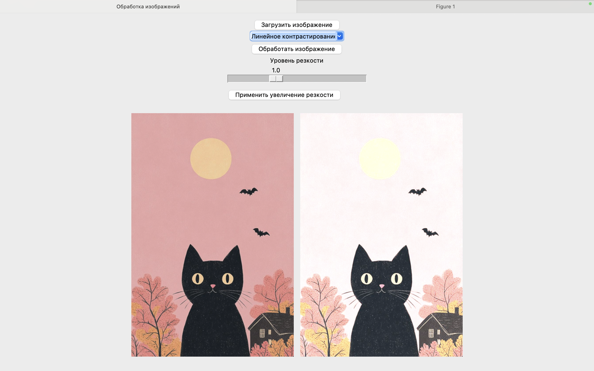

# Lab2

Lab2 - это лабораторная №2, написанная в рамка курса "Компьютерная графика". 
Целью этой лабораторной работы было написать веб-приложение, 
которое строит гистограмму выбранного пользователем изображения в одном окне, 
в другом демонстрирует само изображение и рядом его дубликат
и позволяет пользователю применять к выбранному им изображению следующие 4 метода (функции):
- Линейное контрастирование
- Эквализация гистограммы (RGB)
- Эквализация гистограммы (HSV)
- Оригинальное изображение

Результат работы этих методов демонстрируется на дубликате изображения.
Также дубликат можно вернуть к оригинальному виду.

## Превью

