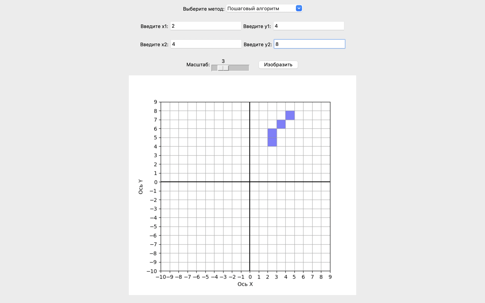

# Lab3

Lab3 - это лабораторная №2, написанная в рамка курса "Компьютерная графика". 
Целью этой лабораторной работы было написать веб-приложение, 
иллюстрирующее работу базовых растровых алгоритмов (4 алгоритма):
- Пошаговый алгоритм
- Алгоритм ЦДУ
- Алгоритм Брезенхема (для линии)
- Алгоритм Брезенхема (для коружности)

Программа позволяет пользователю самостоятельно выбрать координаты точек начала и конца прямой
или центра и края окружности, масштаб плоскости и с помощью какого алгоритма он хочет построить прямую (окружность)

## Превью
### Пошаговый алгоритм

